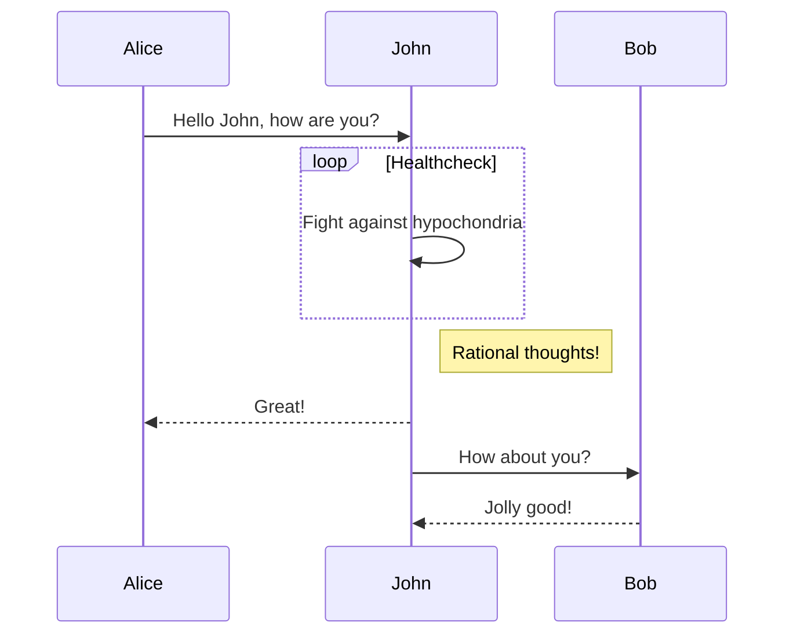
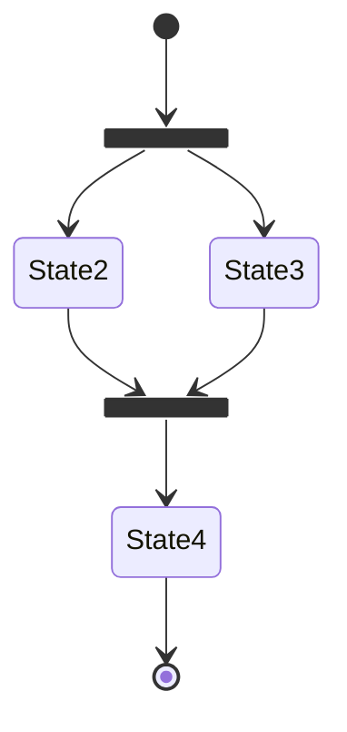
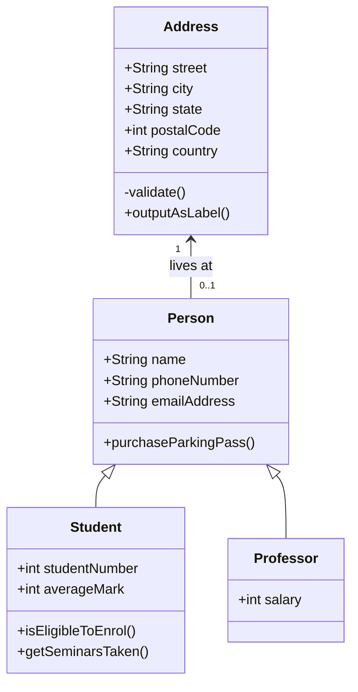
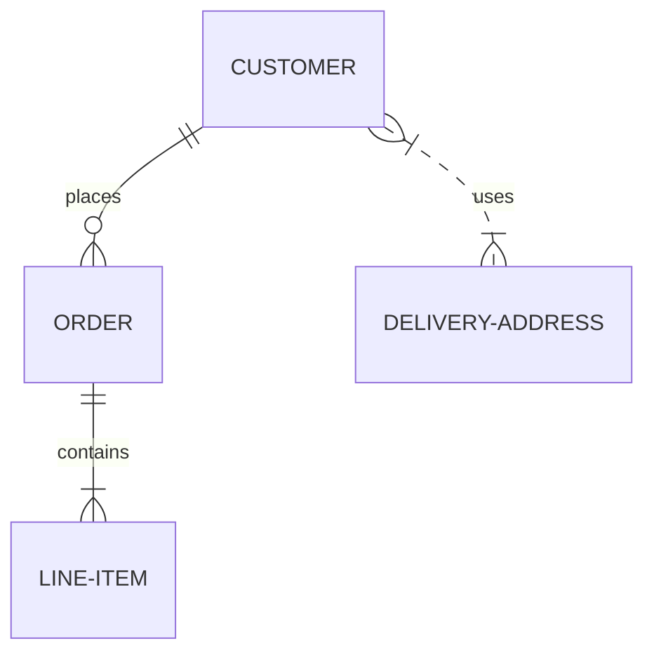

# Testing diagrams!

## Diagrams by MkDocs

### Sequence diagram

### State diagram

### Class diagram

### Entity-relationship diagram

## Diagrams by Mermaid

<html>
  <body>
    Here is one mermaid diagram:
    <pre class="mermaid">
            graph TD 
            A[Client] --> B[Load Balancer] 
            B --> C[Server1] 
            B --> D[Server2]
    </pre>

    And here is another:
    <pre class="mermaid">
            graph TD
            A[Client] -->|tcp_123| B
            B(Load Balancer)
            B -->|tcp_456| C[Server1]
            B -->|tcp_456| D[Server2]
    </pre>

  </body>
</html>

### Here is a graph with subgraphs

<html>
  <body>
    <pre class="mermaid">
      flowchart LR
        subgraph TOP
          direction TB
          subgraph B1
              direction RL
              i1 -->f1
          end
          subgraph B2
              direction BT
              i2 -->f2
          end
        end
        A --> TOP --> B
        B1 --> B2
    </pre>
  </body>
</html>

### Another graph with subgraphs

<html>
  <body>
    <pre class="mermaid">
      flowchart TB
          c1-->a2
          subgraph one
          a1-->a2
          end
          subgraph two
          b1-->b2
          end
          subgraph three
          c1-->c2
          end
          one --> two
          three --> two
          two --> c2
    </pre>
  </body>
</html>

### An algorithm

<html>
  <body>
    <pre class="mermaid">
      flowchart TD
          A[Start] --> B{Is it?}
          B -- Yes --> C[OK]
          C --> D[Rethink]
          D --> B
          B -- No ----> E[End]
    </pre>
  </body>
</html>

### A customized algorithm

<html>
  <body>
    <pre class="mermaid">
      flowchart LR
          A[Hard edge] -->|Link text| B(Round edge)
          B --> C{Decision}
          C -->|One| D[Result one]
          C -->|Two| E[Result two]
    </pre>
  </body>
</html>

### Fontawesome support works?

<html>
  <body>
    <pre class="mermaid">
      flowchart TD
          B["fab:fa-twitter for peace"]
          B-->C[fa:fa-ban forbidden]
          B-->D(fa:fa-spinner);
          B-->E(A fa:fa-camera-retro perhaps?)
    </pre>
  </body>
</html>

### Long requirement diagram

<html>
  <body>
    <pre class="mermaid">
      requirementDiagram

      requirement test_req {
      id: 1
      text: the test text.
      risk: high
      verifymethod: test
      }

      functionalRequirement test_req2 {
      id: 1.1
      text: the second test text.
      risk: low
      verifymethod: inspection
      }

      performanceRequirement test_req3 {
      id: 1.2
      text: the third test text.
      risk: medium
      verifymethod: demonstration
      }

      interfaceRequirement test_req4 {
      id: 1.2.1
      text: the fourth test text.
      risk: medium
      verifymethod: analysis
      }

      physicalRequirement test_req5 {
      id: 1.2.2
      text: the fifth test text.
      risk: medium
      verifymethod: analysis
      }

      designConstraint test_req6 {
      id: 1.2.3
      text: the sixth test text.
      risk: medium
      verifymethod: analysis
      }

      element test_entity {
      type: simulation
      }

      element test_entity2 {
      type: word doc
      docRef: reqs/test_entity
      }

      element test_entity3 {
      type: "test suite"
      docRef: github.com/all_the_tests
      }

      test_entity - satisfies -> test_req2
      test_req - traces -> test_req2
      test_req - contains -> test_req3
      test_req3 - contains -> test_req4
      test_req4 - derives -> test_req5
      test_req5 - refines -> test_req6
      test_entity3 - verifies -> test_req5
      test_req <- copies - test_entity2
      </pre>

  </body>
</html>

### Pie chart

<html>
  <body>
    <pre class="mermaid">
      pie showData
          title Key elements in Product X
          "Calcium" : 42.96
          "Potassium" : 50.05
          "Magnesium" : 10.01
          "Iron" :  5
    </pre>
  </body>
</html>

### C4 Diagram

<html>
  <body>
    <pre class="mermaid">
      C4Dynamic
      title Dynamic diagram for Internet Banking System - API Application

      ContainerDb(c4, "Database", "Relational Database Schema", "Stores user registration information, hashed authentication credentials, access logs, etc.")
      Container(c1, "Single-Page Application", "JavaScript and Angular", "Provides all of the Internet banking functionality to customers via their web browser.")
      Container_Boundary(b, "API Application") {
        Component(c3, "Security Component", "Spring Bean", "Provides functionality Related to signing in, changing passwords, etc.")
        Component(c2, "Sign In Controller", "Spring MVC Rest Controller", "Allows users to sign in to the Internet Banking System.")
      }
      Rel(c1, c2, "Submits credentials to", "JSON/HTTPS")
      Rel(c2, c3, "Calls isAuthenticated() on")
      Rel(c3, c4, "select * from users where username = ?", "JDBC")

      UpdateRelStyle(c1, c2, $textColor="red", $offsetY="-40")
      UpdateRelStyle(c2, c3, $textColor="red", $offsetX="-40", $offsetY="60")
      UpdateRelStyle(c3, c4, $textColor="red", $offsetY="-40", $offsetX="10")
    </pre>

  </body>
</html>

### Git Graph

<html>
  <body>
    <pre class="mermaid">
      gitGraph
          commit id: "1"
          commit id: "2"
          branch nice_feature
          checkout nice_feature
          commit id: "3"
          checkout main
          commit id: "4"
          checkout nice_feature
          branch very_nice_feature
          checkout very_nice_feature
          commit id: "5"
          checkout main
          commit id: "6"
          checkout nice_feature
          commit id: "7"
          checkout main
          merge nice_feature id: "customID" tag: "customTag" type: REVERSE
          checkout very_nice_feature
          commit id: "8"
          checkout main
          commit id: "9"
    </pre>
  </body>
</html>

### Gantt Diagram

<html>
  <body>
    <pre class="mermaid">
      gantt
          apple :a, 2017-07-20, 1w
          banana :crit, b, 2017-07-23, 1d
          cherry :active, c, after b a, 1d
    </pre>
  </body>
</html>

### User Journey Diagram

<html>
  <body>
      <pre class="mermaid">
        journey
            title My working day
            section Go to work
              Make tea: 5: Me
              Go upstairs: 3: Me
              Do work: 1: Me, Cat
            section Go home
              Go downstairs: 5: Me
              Sit down: 5: Me
        </pre>
  </body>
</html>

### Custom Theme

<html>
  <body>
    

      <pre class="mermaid">
        %%{init: {'theme': 'base', 'themeVariables': { 'primaryColor': '#ffcccc', 'edgeLabelBackground':'#ffffee', 'tertiaryColor': '#fff0f0'}}}%%
                graph TD
                  A[Christmas] -->|Get money| B(Go shopping)
                  B --> C{Let me think}
                  B --> G[/Another/]
                  C ==>|One| D[Laptop]
                  C -->|Two| E[iPhone]
                  C -->|Three| F[fa:fa-car Car]
                  subgraph section
                    C
                    D
                    E
                    F
                    G
                  end
        </pre>
    

</html>
